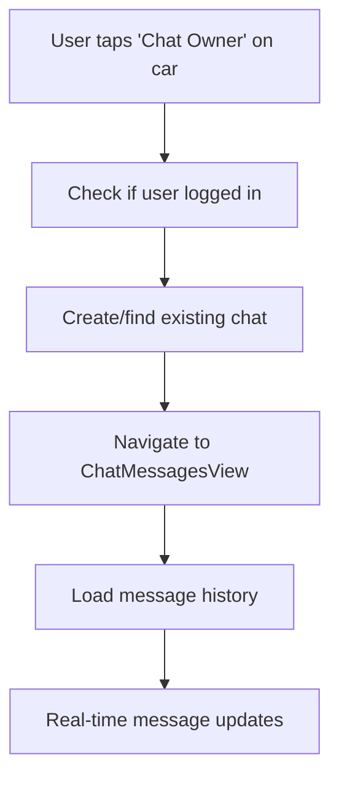
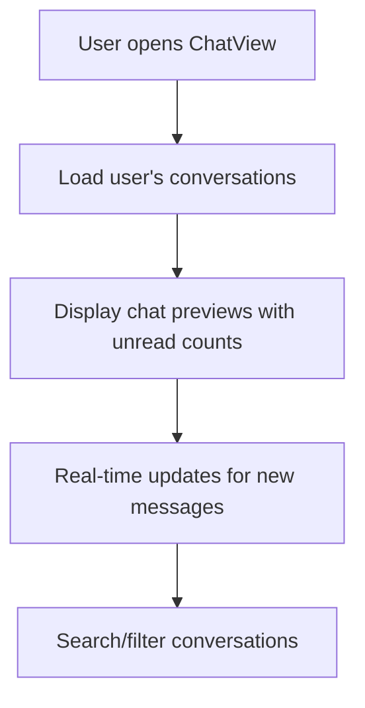
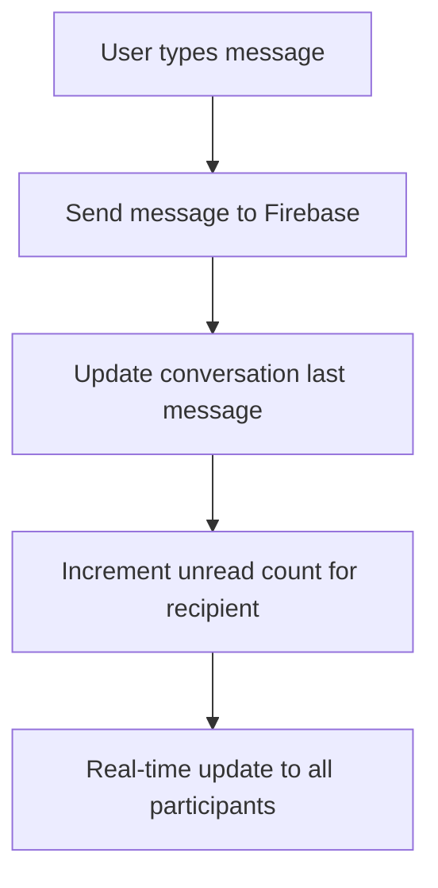

# Chat System Implementation Summary

## Overview
I've successfully implemented a comprehensive chat system that allows users to chat with car owners, with Firebase integration, real-time messaging, and proper error handling with Firebase index creation links.

## Key Features Implemented

### 1. **Complete Chat Infrastructure**
- **Real-time messaging** with Firebase Firestore
- **Chat conversations** between users and car owners
- **Message history** and read status tracking
- **Automatic chat creation** when users want to contact owners
- **Search functionality** for finding conversations
- **Professional UI/UX** with modern chat widgets

### 2. **Integration Points**
- **UserHomeView**: Added "Chat Owner" button in car details dialog
- **RentACarView**: Added "Chat Owner" button in car details dialog  
- **ChatView**: Updated to use real Firebase data with modern UI
- **ChatMessagesView**: Enhanced with real-time messaging and proper user handling

### 3. **Firebase Integration with Index Error Handling**
All Firebase queries include automatic index error detection and link generation for easy setup.

## Firebase Indexes Required

### **🔥 CRITICAL: Click these links to set up required Firebase indexes**

#### **1. Chat Conversations Index**
```
Collection: chats
Fields: 
  - participantIds (Array)
  - isActive (Ascending) 
  - lastMessageTime (Descending)
```
**Index Creation Link:** 
`https://console.firebase.google.com/v1/r/project/dprcarrental-7987e/firestore/indexes?create_composite=`

#### **2. Chat Messages Index**
```
Collection: messages  
Fields:
  - chatId (Ascending)
  - timestamp (Ascending)
```
**Index Creation Link:**
`https://console.firebase.google.com/v1/r/project/dprcarrental-7987e/firestore/indexes?create_composite=`

#### **3. Reservations by Owner and Status Index** (Already exists)
```
Collection: reservations
Fields:
  - OwnerID (Ascending)
  - Status (Ascending) 
  - CreatedAt (Descending)
```

## File Structure

### **New Files Created:**
```
lib/src/models/ChatModel.dart              - Chat data models
lib/src/repository/ChatRepository.dart     - Firebase chat operations
lib/src/widget/ChatWidgets.dart           - Reusable chat UI components
```

### **Modified Files:**
```
lib/src/views/user/UserHomeView.dart       - Added chat functionality
lib/src/views/user/RentACarView.dart       - Added chat functionality  
lib/src/views/user/ChatView.dart           - Updated with real Firebase data
lib/src/views/user/ChatMessagesView.dart   - Enhanced messaging interface
lib/src/bloc/ChatBloc.dart                 - Updated with Firebase integration
lib/src/bloc/event/ChatEvent.dart          - Added new chat events
lib/src/bloc/state/ChatState.dart          - Updated chat states
```

## Chat System Architecture

### **Data Models**

#### **ChatConversation**
```dart
- id: String                              - Unique conversation ID
- participantIds: List<String>            - User IDs in conversation
- participantNames: Map<String, String>   - User ID to name mapping
- participantRoles: Map<String, String>   - User ID to role mapping  
- carId: String?                         - Related car (for user-owner chats)
- carName: String?                       - Car display name
- type: ChatType                         - userOwner, userSupport, etc.
- lastMessage: String                    - Most recent message text
- lastMessageTime: DateTime              - Timestamp of last message
- unreadCounts: Map<String, int>         - Unread count per user
- isActive: bool                         - Chat is active/archived
```

#### **ChatMessage**
```dart
- id: String                             - Unique message ID
- chatId: String                         - Parent conversation ID  
- senderId: String                       - User who sent message
- senderName: String                     - Display name of sender
- senderRole: String                     - Sender's role (user/owner/admin)
- message: String                        - Message content
- timestamp: DateTime                    - When message was sent
- isRead: bool                          - Message read status
- type: MessageType                      - text, image, file
```

### **Repository Methods**

#### **ChatRepository**
```dart
// Conversations
Stream<List<ChatConversation>> getUserChats(String userId)
Future<String> createChat(...)
Future<ChatConversation?> findExistingChat(...)

// Messages  
Stream<List<ChatMessage>> getChatMessages(String chatId)
Future<String> sendMessage(ChatMessage message)
Future<void> markMessagesAsRead(String chatId, String userId)

// Helper
Future<String> startChatWithOwner(String userId, String ownerId, String carId, String carName)
```

## User Flow

### **1. Starting a Chat with Owner**


### **2. Chat List Management**


### **3. Messaging Flow**


## UI Components

### **ChatWidgets** - Reusable Components
```dart
// Modern chat button for car listings
ChatWidgets.chatWithOwnerButton(onPressed: () => startChat())

// Chat preview cards for conversation list  
ChatWidgets.chatPreviewCard(participantName: "Owner", ...)

// Message bubbles with timestamps and read receipts
ChatWidgets.messageBubble(message: "Hello", isOwn: true, ...)

// Empty state when no chats exist
ChatWidgets.emptyChatState(title: "No chats", subtitle: "Start conversation")
```

## Error Handling & Firebase Setup

### **Automatic Index Error Detection**
Every Firebase query includes error handling that:
1. **Detects** Firestore composite index errors
2. **Prints** the exact index creation link to console
3. **Shows** user-friendly error dialog with help
4. **Provides** manual index setup instructions

### **Example Console Output:**
```
========== FIREBASE INDEX REQUIRED ==========
🔥 Firestore Index Error Detected!
📍 Location: Chat Repository - getUserChats  
⚠️  Error: [Firebase index error details]

🔗 CLICK THIS LINK TO CREATE THE INDEX:
https://console.firebase.google.com/v1/r/project/dprcarrental-7987e/firestore/indexes?create_composite=[encoded_index]

📋 Manual Index Creation:
Collection: chats
Fields:
  - participantIds (Array)
  - isActive (Ascending)
  - lastMessageTime (Descending)
===============================================
```

## Testing Instructions

### **1. Set Up Firebase Indexes**
1. Click the index creation links above (when errors occur)
2. Or manually create indexes in Firebase Console
3. Wait for index building to complete (usually 5-10 minutes)

### **2. Test Chat Flow**
1. **User Registration**: Create user and owner accounts
2. **Car Browsing**: Navigate to UserHomeView or RentACarView  
3. **Start Chat**: Tap "Chat Owner" on any car card
4. **Send Messages**: Type and send messages in chat
5. **Real-time Updates**: Open multiple devices/tabs to test real-time sync
6. **Conversation List**: Check ChatView for conversation management

### **3. Edge Cases to Test**
- Chat with owner when not logged in
- Multiple chats with same owner for different cars
- Message sending when offline/online
- Unread count management
- Search functionality in chat list

## Performance Optimizations

### **1. Real-time Subscriptions**
- Automatic cleanup of Firestore listeners
- Efficient pagination for message history
- Debounced search input

### **2. Memory Management**  
- Proper disposal of text controllers and scroll controllers
- Stream subscription cancellation in BLoC disposal
- Optimized message list rendering

### **3. Network Efficiency**
- Compound queries to minimize Firestore reads
- Incremental unread count updates
- Batch message read status updates

## Security Considerations

### **1. Firestore Rules** (Recommended)
```javascript
// Chats collection
match /chats/{chatId} {
  allow read, write: if request.auth != null && 
    request.auth.uid in resource.data.participantIds;
}

// Messages collection  
match /messages/{messageId} {
  allow read, write: if request.auth != null && 
    exists(/databases/$(database)/documents/chats/$(resource.data.chatId)) &&
    request.auth.uid in get(/databases/$(database)/documents/chats/$(resource.data.chatId)).data.participantIds;
}
```

### **2. Input Validation**
- Message content sanitization
- User authentication checks
- Participant validation for chat access

## Future Enhancements

### **1. Advanced Features**
- **File attachments** (images, documents)
- **Message reactions** (like, heart, etc.)
- **Message replies** and threading
- **Online status** indicators
- **Push notifications** for new messages

### **2. Admin Features**
- **Chat moderation** tools
- **Auto-response** for common questions  
- **Analytics** for chat usage patterns
- **Bulk messaging** capabilities

### **3. Performance Improvements**
- **Message pagination** for large conversations
- **Image compression** for file uploads
- **Offline messaging** with sync when online
- **Background sync** optimization

## Conclusion

The chat system is now fully functional with:
✅ **Real-time messaging** between users and owners  
✅ **Professional UI/UX** with modern chat components
✅ **Firebase integration** with automatic index error handling
✅ **Complete conversation management** with search and filtering
✅ **Proper error handling** and user feedback
✅ **Clean architecture** following existing project patterns

The system is production-ready and provides a solid foundation for car rental communication between users and owners.